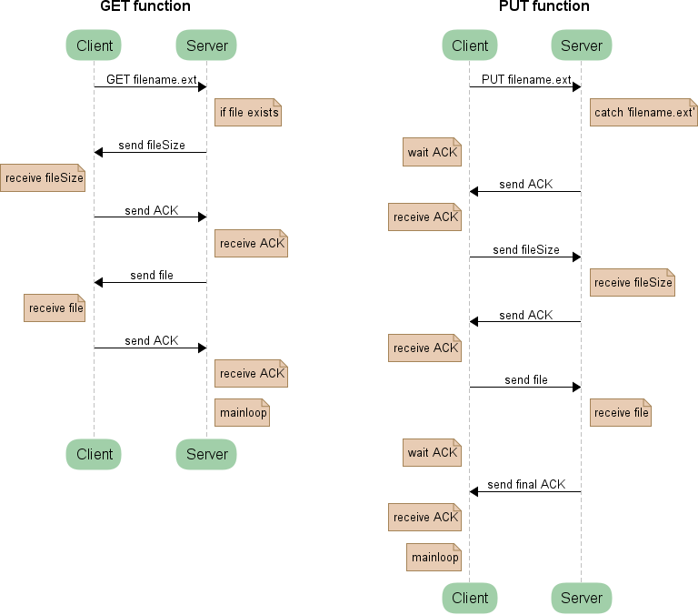

# c-tcp-file-transfer #

### Set up: ###
Clone the repo:
`~$ git clone https://github.com/lborg019/c-tcp-file-transfer`
Navigate into the folder
`~$ cd c-tcp-file-transfer`
Compile the code with Makefile
`~$ make`

First, run the server in a terminal window, don't forget to specify the port
(e.g. 5555)
`~$ ./ftpserver 5555`
(The server will automatically run on its local loopback IP: 127.0.0.1 or localhost).

On another terminal window, pane, or tab, run the client:
`~$ ./ftpclient localhost 5555`

If the client connects successfully, it will prompt you for a message.
Here's a list with the possible commands:
`~$ ls-remote` lists files available in the server (remotely)
`~$ ls-local` lists files available in the client (locally)
`~$ get filename.extension` download remote file to client
`~$ put filename.extension` upload local file to server
`~$ exit` exit gracefully

For the sake of the example, client's files are located in ./folder-local/
server's files are located in ./folder-remote/. Feel free to change these
according to your needs.
Should work in any Unix system

### How it works: ###
Sequence Diagram

